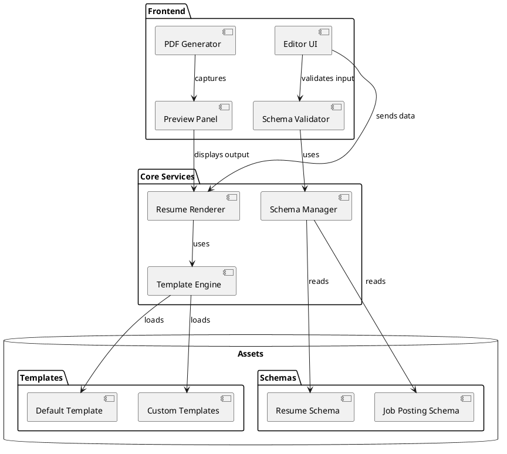
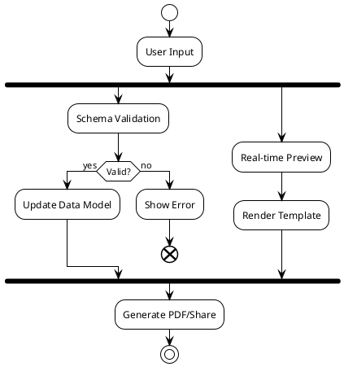
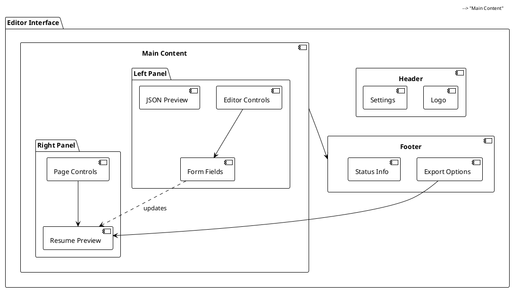
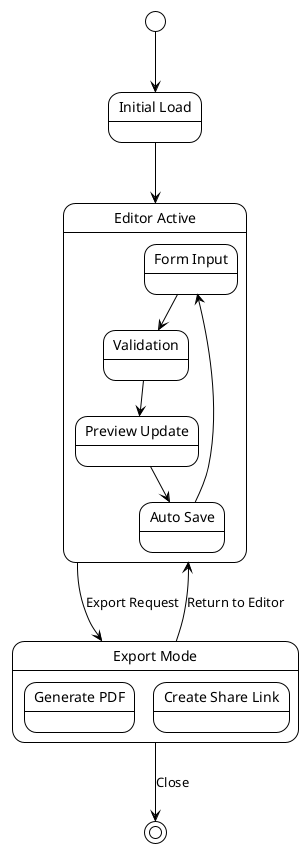
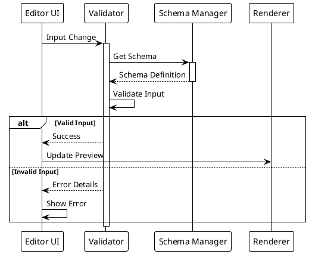

# Finnessume

Professional resume generation and management system with dynamic templating and schema validation.

## Architecture Overview



## Data Flow



## UI Component Layout



## State Management



## Schema Validation Process



## Installation

```bash
npm install @pegues/finnessume
```

## Usage

```javascript
import { renderResume } from '@pegues/finnessume';

// Initialize with resume data
renderResume(resumeData, targetElement);
```

## Development

```bash
# Install dependencies
npm install

# Start development server
npm start

# Run tests
npm test

# Build for production
npm run build
```

## Features

- Dynamic resume editing with real-time preview
- JSON schema validation
- Multiple template support
- PDF export
- Share via URL
- Responsive design
- Custom schema support

## License

MIT © Jeremiah Pegues

# jpres-gen

## Features

### Job Processing
Converts job descriptions into structured JSON format using OpenAI's GPT-4.

```bash
npm run job-process
```

### Resume Finesse
Enhances resumes to better match job descriptions while maintaining truthfulness.

```bash
npm run finesse
```

## API Endpoints

### POST /api/job-process
Converts job description text to structured JSON.

Request body:
```json
{
  "content": "Job description text"
}
```

### POST /api/finesse
Enhances resume based on job posting.

Request body:
```json
{
  "content": {
    "parsedResume": {},
    "parsedJobPosting": {}
  },
  "exactRole": boolean
}
```

## Environment Variables
- OPENAI_API_KEY: Your OpenAI API key

## Logging
Logs are written to:
- console (all levels)
- error.log (error level)
- combined.log (all levels)

Logs follow syslog format with JSON structure.
