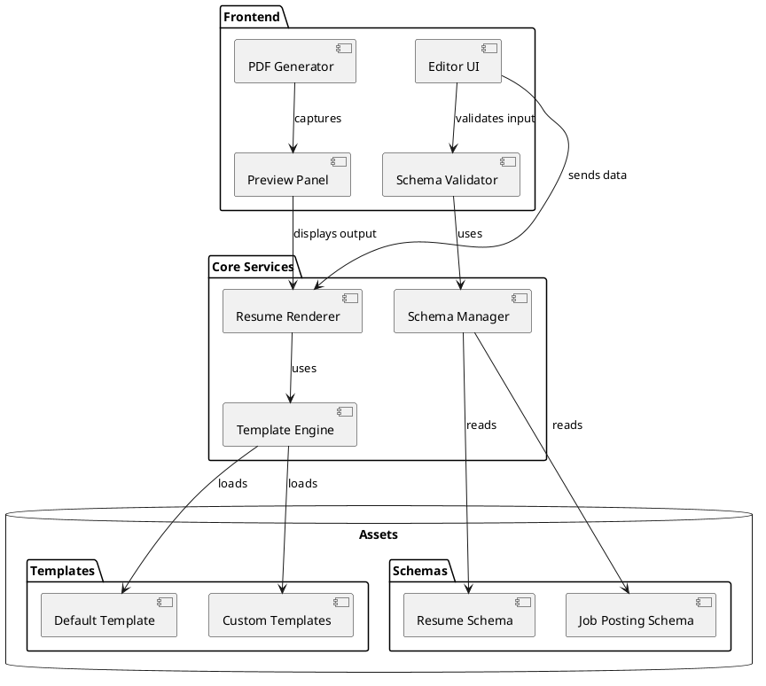
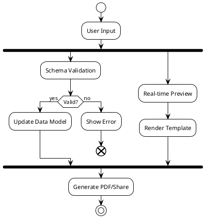
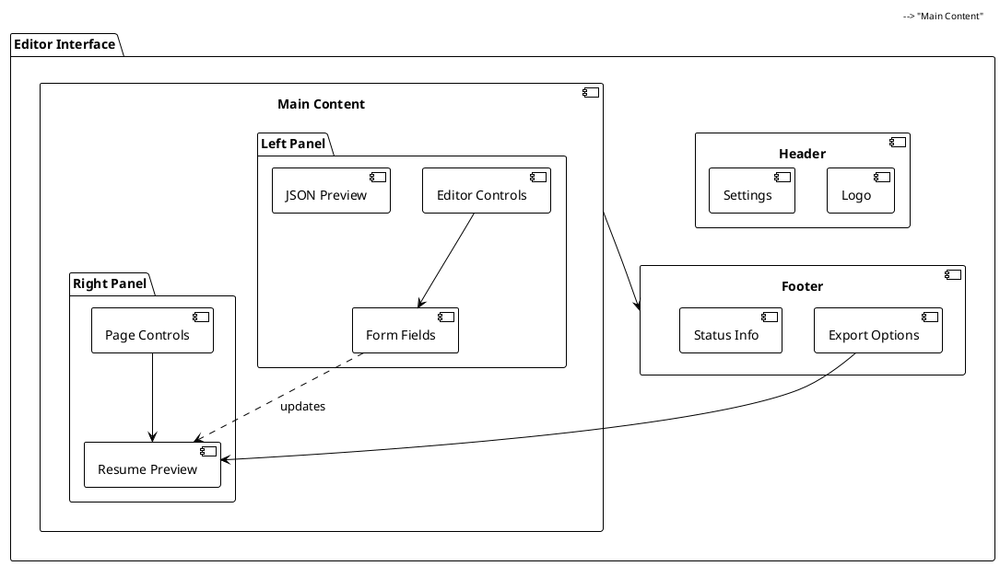
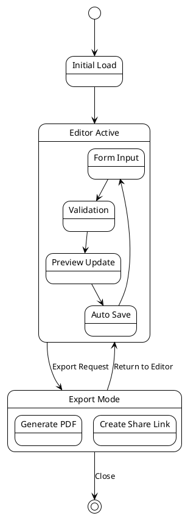
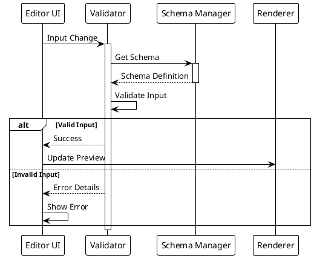

# JPres-Gen: Professional Resume Generator

A professional resume generation and management system with dynamic templating and schema validation.

## Architecture Overview



## Data Flow



## UI Component Layout



## State Management



## Schema Validation Process



## Installation

```bash
npm install @pyj/finnesse
```

## Available Commands

### Development Commands

```bash
# Start the development server
npm start

# Watch for CSS changes
npm run watch-css

# Watch for JavaScript changes
npm run watch-js

# Run tests in watch mode
npm run test:watch
```

### Testing Commands

```bash
# Run all tests with coverage
npm test

# Run unit tests only
npm run test:unit

# Run integration tests
npm run test:integration
```

### Build Commands

```bash
# Build everything
npm run build

# Build CSS only
npm run build-css

# Build JavaScript only
npm run build-js
```

### Resume Processing

```bash
# Process a resume against a job posting
npm run finesse-resume -- -r /path/to/resume.json -j /path/to/job.json -o output.json

# Process a job posting
npm run job-process

# Run the finesse service
npm run finesse
```

### Job Processing Commands

```bash
# Process a job posting from text or file
npm run process-job -- -i "job description text" -o processed-job.json
# OR
npm run process-job -- -i job-description.txt -o processed-job.json

# Process a resume against a job posting
npm run finesse-resume -- -r resume.json -j job.json -o enhanced-resume.json
```

### Validation Commands

```bash
# Validate schemas
npm run validate:schema

# Validate general content
npm run validate
```

### Code Quality Commands

```bash
# Format code
npm run format

# Run linter
npm run lint
```

### Publishing Commands

```bash
# Prepare for publishing
npm run prepublishOnly

# Publish to npm
npm run publish-npm

# Create a new release
npm run release
```

## Examples

### Processing a Resume

1. Create a resume JSON file (resume.json):

```json
{
  "name": "John Doe",
  "title": "Software Engineer",
  "skills": ["JavaScript", "TypeScript", "Node.js"],
  "experience": [
    {
      "title": "Senior Developer",
      "company": "Tech Corp",
      "duration": "2 years"
    }
  ]
}
```

2. Create a job posting JSON file (job.json):

```json
{
  "title": "Senior Software Engineer",
  "company": "Innovation Inc",
  "requirements": ["JavaScript", "Node.js", "AWS"],
  "responsibilities": ["Lead development", "Code review"]
}
```

3. Run the finesse command:

```bash
npm run finesse-resume -- -r resume.json -j job.json -o enhanced-resume.json
```

## Environment Variables

Create a `.env` file with:

```
OPENAI_API_KEY=your_api_key_here
```

## Contributing

1. Fork the repository
2. Create your feature branch (`git checkout -b feature/amazing-feature`)
3. Run tests (`npm test`)
4. Commit your changes (`git commit -m 'Add amazing feature'`)
5. Push to the branch (`git push origin feature/amazing-feature`)
6. Open a Pull Request

## License

MIT License - see LICENSE file for details
