<<<<<<< Updated upstream
# JPres-Gen: Professional Resume Generator

A professional resume generation and management system with dynamic templating and schema validation.

## Architecture Overview

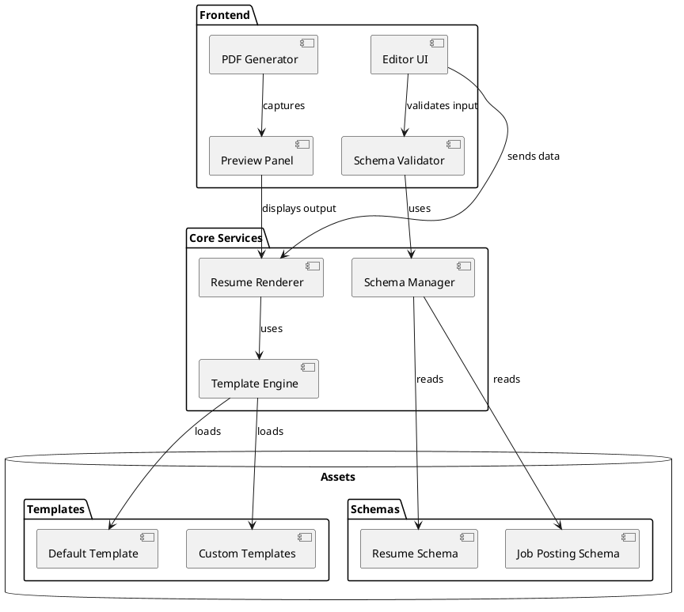

## Data Flow

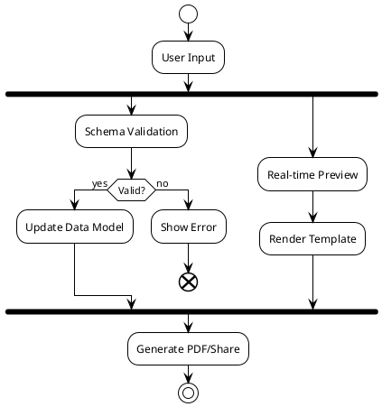

## UI Component Layout

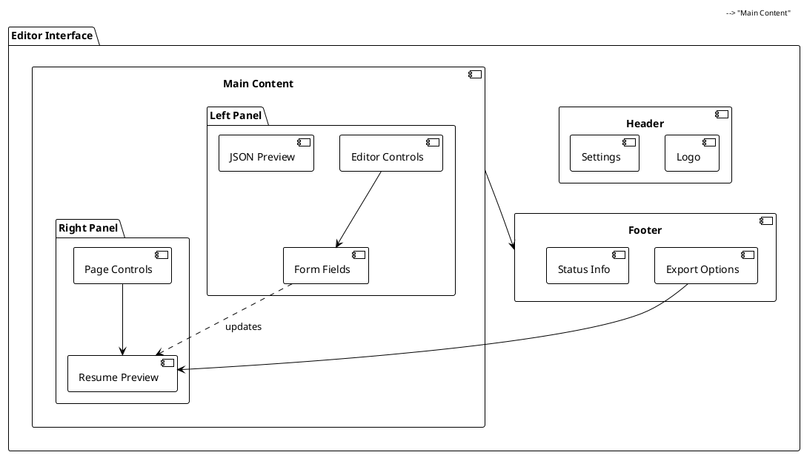

## State Management

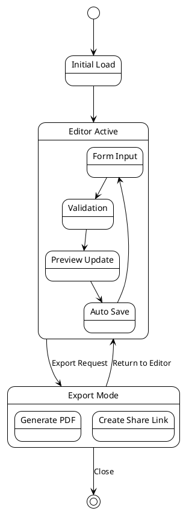

## Schema Validation Process

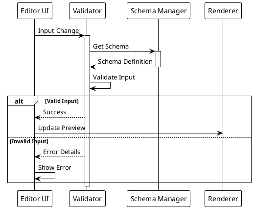

## Installation

```bash
npm install @pyj/finnesse
```

## Available Commands

### Development Commands

```bash
# Start the development server
npm start

# Watch for CSS changes
npm run watch-css

# Watch for JavaScript changes
npm run watch-js

# Run tests in watch mode
npm run test:watch
```

### Testing Commands

```bash
# Run all tests with coverage
npm test

# Run unit tests only
npm run test:unit

# Run integration tests
npm run test:integration
```

### Build Commands

```bash
# Build everything
npm run build

# Build CSS only
npm run build-css

# Build JavaScript only
npm run build-js
```

### Resume Processing

```bash
# Process a resume against a job posting
npm run finesse-resume -- -r /path/to/resume.json -j /path/to/job.json -o output.json

# Process a job posting
npm run job-process

# Run the finesse service
npm run finesse
```

### Job Processing Commands

```bash
# Process a job posting from text or file
npm run process-job -- -i "job description text" -o processed-job.json
# OR
npm run process-job -- -i job-description.txt -o processed-job.json

# Process a resume against a job posting
npm run finesse-resume -- -r resume.json -j job.json -o enhanced-resume.json
```

### Validation Commands

```bash
# Validate schemas
npm run validate:schema

# Validate general content
npm run validate
```

### Code Quality Commands

```bash
# Format code
npm run format

# Run linter
npm run lint
```

### Publishing Commands

```bash
# Prepare for publishing
npm run prepublishOnly

# Publish to npm
npm run publish-npm

# Create a new release
npm run release
```

## Examples

### Processing a Resume

1. Create a resume JSON file (resume.json):

```json
{
  "name": "John Doe",
  "title": "Software Engineer",
  "skills": ["JavaScript", "TypeScript", "Node.js"],
  "experience": [
    {
      "title": "Senior Developer",
      "company": "Tech Corp",
      "duration": "2 years"
    }
  ]
}
```

2. Create a job posting JSON file (job.json):

```json
{
  "title": "Senior Software Engineer",
  "company": "Innovation Inc",
  "requirements": ["JavaScript", "Node.js", "AWS"],
  "responsibilities": ["Lead development", "Code review"]
}
```

3. Run the finesse command:

```bash
npm run finesse-resume -- -r resume.json -j job.json -o enhanced-resume.json
=======
# Finessume

A professional resume generation and management system built with Phoenix, LiveView, and Petal Components.

## Technology Stack

- Elixir/Phoenix for the backend and web framework
- Phoenix LiveView for real-time UI updates
- Petal Components for UI components
- TailwindCSS for styling
- PostgreSQL for data persistence
- OpenAI integration for resume enhancement

## Architecture Overview

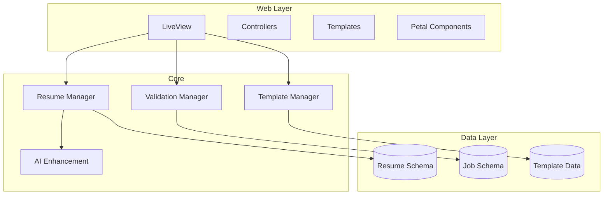

## Project Structure

```
finessume/
├── assets/
│   ├── css/
│   └── js/
├── config/
├── lib/
│   ├── finessume/
│   │   ├── resumes/          # Resume context
│   │   ├── templates/        # Template context
│   │   ├── accounts/         # User accounts
│   │   └── ai/              # AI integration
│   ├── finessume_web/
│   │   ├── live/            # LiveView modules
│   │   ├── components/      # Custom components
│   │   └── templates/       # HTML templates
│   └── finessume.ex
├── priv/
│   ├── repo/
│   └── static/
└── test/
```

## Setup

```bash
# Clone the repository
git clone <repository-url>
cd finessume

# Install dependencies
mix deps.get
mix ecto.setup

# Install Node.js dependencies
cd assets && npm install

# Start Phoenix server
mix phx.server
```

Visit [`localhost:4000`](http://localhost:4000) from your browser.

## Key Features

### LiveView Components

- Resume Editor
- Real-time Preview
- Template Selector
- PDF Generator
- AI Enhancement Interface

### Petal Components Integration

```elixir
# Example LiveView with Petal Components
defmodule FinessumeWeb.ResumeLive.Editor do
  use FinessumeWeb, :live_view
  use PetalComponents

  def render(assigns) do
    ~H"""
    <.container>
      <.h1>Resume Editor</.h1>

      <.card>
        <.form
          :let={f}
          for={@changeset}
          phx-change="validate"
          phx-submit="save">

          <.form_field type="text" form={f} field={:title} label="Title"/>
          <.button>Save</.button>
        </.form>
      </.card>
    </.container>
    """
  end
end
```

## User Journey

1. **Onboarding:** Users visit the landing page to learn about Finessume before registering or logging in.
2. **Registration & Login:** New users sign up or existing users log in to access the resume builder.
3. **Resume Creation:** Users start creating their resume using the intuitive LiveView editor.
4. **Real-time Editing:** Changes update in real-time, with options to select templates and modify content.
5. **AI Enhancement:** Users can enhance their resumes using integrated AI features.
6. **Finalization & Download:** Completed resumes can be saved, downloaded as PDFs, and shared.

## Schema Examples

```elixir
defmodule Finessume.Resumes.Resume do
  use Ecto.Schema
  import Ecto.Changeset

  schema "resumes" do
    field :title, :string
    field :content, :map
    field :template_id, :id
    field :user_id, :id

    timestamps()
  end

  def changeset(resume, attrs) do
    resume
    |> cast(attrs, [:title, :content])
    |> validate_required([:title, :content])
  end
end
```

## Development Commands

```bash
# Start development server
mix phx.server

# Run tests
mix test

# Generate migration
mix ecto.gen.migration create_resumes

# Run migrations
mix ecto.migrate

# Start IEx with Phoenix
iex -S mix phx.server
```

## Testing

```bash
# Run all tests
mix test

# Run specific test file
mix test test/finessume/resumes_test.exs

# Run tests with coverage
mix test --cover
>>>>>>> Stashed changes
```

## Environment Variables

Create a `.env` file with:

```
<<<<<<< Updated upstream
OPENAI_API_KEY=your_api_key_here
=======
export OPENAI_API_KEY=your_api_key_here
export SECRET_KEY_BASE=your_secret_key
export DATABASE_URL=your_database_url
```

## Deployment

The application can be deployed to any platform that supports Elixir/Phoenix applications:

```bash
# Build release
MIX_ENV=prod mix release

# Run migrations in production
_build/prod/rel/finessume/bin/finessume eval "Finessume.Release.migrate"

# Start the application
_build/prod/rel/finessume/bin/finessume start
>>>>>>> Stashed changes
```

## Contributing

1. Fork the repository
2. Create your feature branch (`git checkout -b feature/amazing-feature`)
<<<<<<< Updated upstream
3. Run tests (`npm test`)
=======
3. Run tests (`mix test`)
>>>>>>> Stashed changes
4. Commit your changes (`git commit -m 'Add amazing feature'`)
5. Push to the branch (`git push origin feature/amazing-feature`)
6. Open a Pull Request

## License

MIT License - see LICENSE file for details
<<<<<<< Updated upstream
=======

# Resume Optimizer SaaS Architecture Design

## System Overview

This SaaS application will analyze resumes against job descriptions, provide a compatibility score (1-10), and automatically optimize ("finesse") resumes when the score is 7 or higher. The system leverages the Petal Boilerplate (Phoenix, Elixir, TailwindCSS, Alpine.js, LiveView) with LLM integration for intelligent document analysis.

## Domain Model

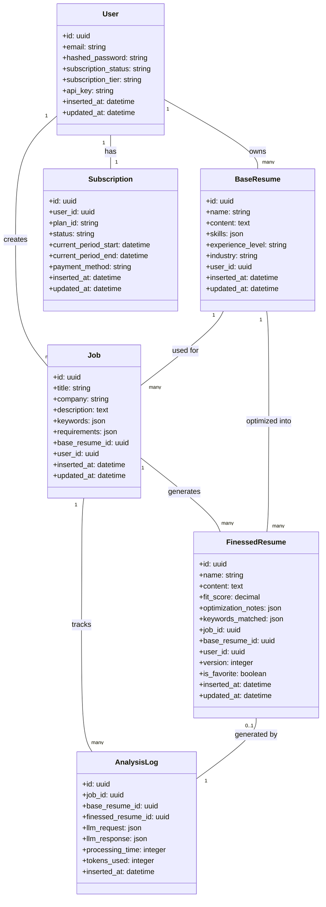

## Context Architecture

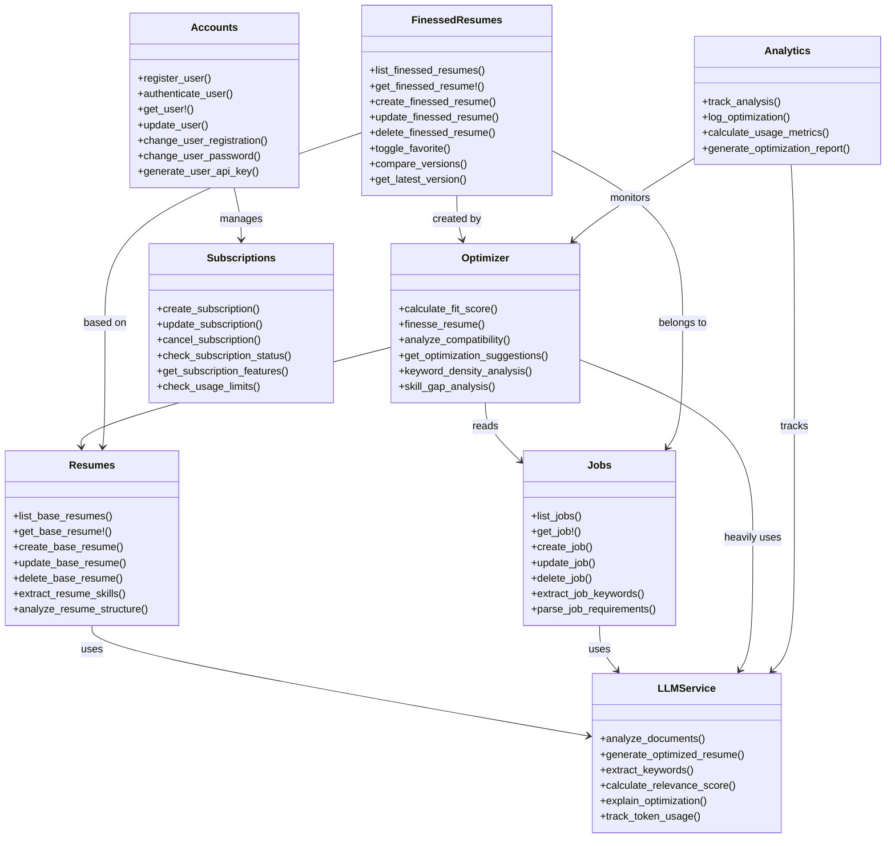

## Application Flow

### Resume Optimization Process

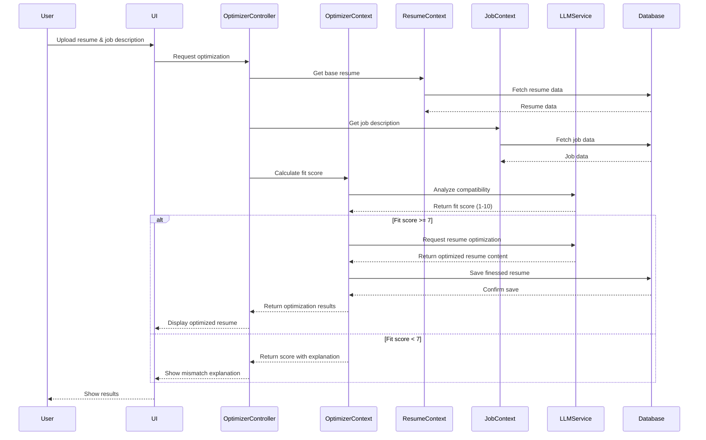

### User Authentication Flow


## LiveView Structure

```mermaid
classDiagram
    class DashboardLive {
        +mount()
        +handle_params()
        +render()
        +handle_event("filter_resumes")
        +handle_event("filter_jobs")
    }

    class ResumeManagementLive {
        +mount()
        +handle_params()
        +render()
        +handle_event("upload_resume")
        +handle_event("edit_resume")
        +handle_event("delete_resume")
    }

    class JobManagementLive {
        +mount()
        +handle_params()
        +render()
        +handle_event("add_job")
        +handle_event("edit_job")
        +handle_event("delete_job")
    }

    class OptimizerLive {
        +mount()
        +handle_params()
        +render()
        +handle_event("start_analysis")
        +handle_event("view_optimization")
        +handle_event("save_finessed_resume")
        +handle_info({:analysis_complete, result})
    }

    class FinessedResumeLive {
        +mount()
        +handle_params()
        +render()
        +handle_event("toggle_favorite")
        +handle_event("compare_versions")
        +handle_event("export_resume")
    }

    class AnalyticsLive {
        +mount()
        +handle_params()
        +render()
        +handle_event("filter_data")
        +handle_event("export_report")
    }

    class SubscriptionLive {
        +mount()
        +handle_params()
        +render()
        +handle_event("change_plan")
        +handle_event("update_payment")
        +handle_event("cancel_subscription")
    }

    class NavbarComponent {
        +render()
    }

    class ResumeFormComponent {
        +update()
        +handle_event("validate")
        +handle_event("save")
    }

    class JobFormComponent {
        +update()
        +handle_event("validate")
        +handle_event("save")
    }

    class ScoreDisplayComponent {
        +update()
        +render()
    }

    class OptimizationResultComponent {
        +update()
        +render()
        +handle_event("accept_changes")
        +handle_event("reject_changes")
    }

    DashboardLive --> NavbarComponent : uses
    ResumeManagementLive --> ResumeFormComponent : uses
    JobManagementLive --> JobFormComponent : uses
    OptimizerLive --> ScoreDisplayComponent : uses
    OptimizerLive --> OptimizationResultComponent : uses
    FinessedResumeLive --> OptimizationResultComponent : uses
```

## UI Wireframes

### Dashboard View

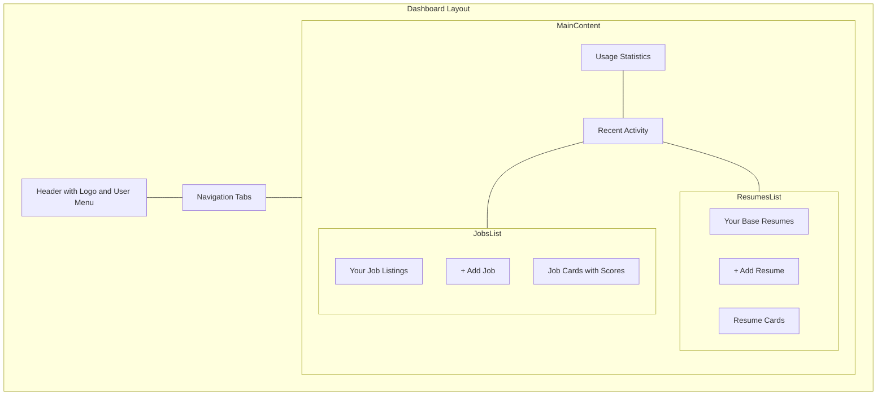

### Optimization Process View

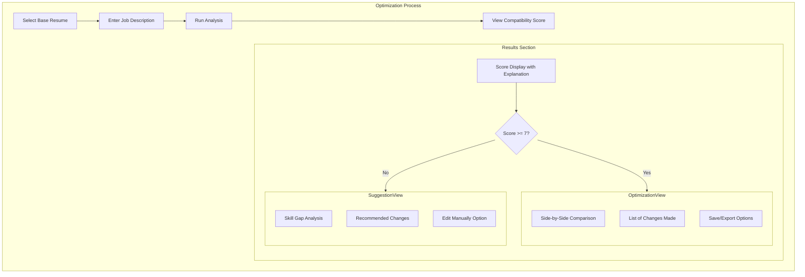

## LLM Integration Architecture

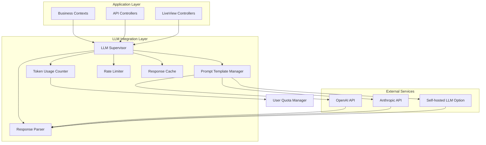

## Deployment Architecture

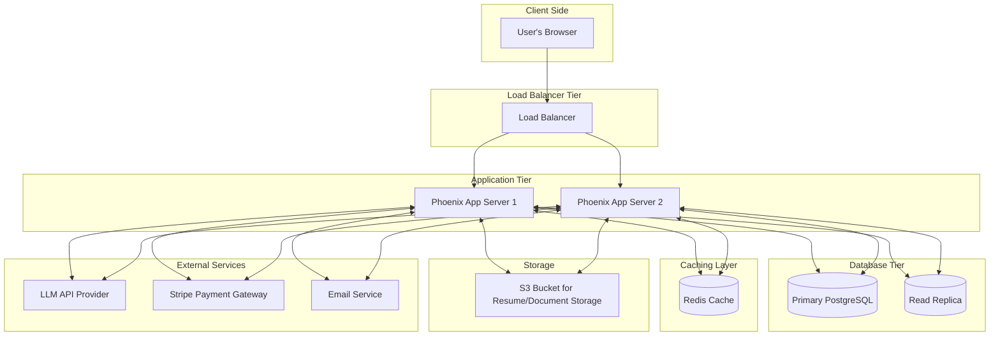

## Core User Journeys

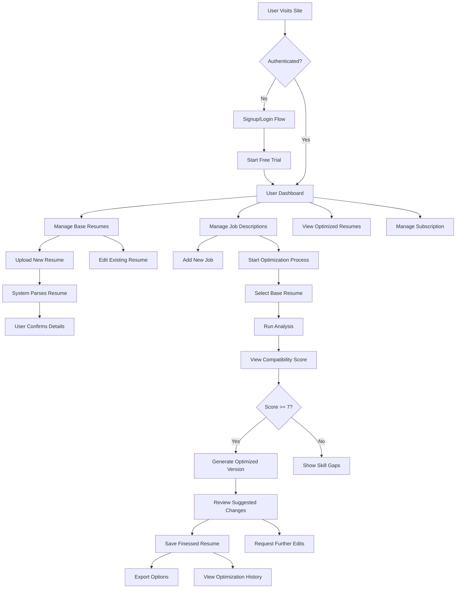

## Subscription and Pricing Model

```mermaid
graph TD
    subgraph "Subscription Tiers"
        Free[Free Tier]
        Basic[Basic Plan]
        Pro[Professional Plan]
        Enterprise[Enterprise Plan]
    end

    subgraph "Free Features"
        FL1[3 Base Resumes]
        FL2[5 Job Analyses/Month]
        FL3[Basic Optimization]
        FL4[PDF Export]
    end

    subgraph "Basic Features"
        BL1[10 Base Resumes]
        BL2[20 Job Analyses/Month]
        BL3[Advanced Optimization]
        BL4[Multiple Export Formats]
        BL5[Email Support]
    end

    subgraph "Pro Features"
        PL1[Unlimited Base Resumes]
        PL2[100 Job Analyses/Month]
        PL3[Priority Optimization]
        PL4[Version History]
        PL5[ATS Compatibility Check]
        PL6[Priority Support]
    end

    subgraph "Enterprise Features"
        EL1[Custom User Roles]
        EL2[Unlimited Everything]
        EL3[API Access]
        EL4[Custom Integrations]
        EL5[Dedicated Support]
        EL6[On-premises Option]
    end

    Free --- FL1
    Free --- FL2
    Free --- FL3
    Free --- FL4

    Basic --- BL1
    Basic --- BL2
    Basic --- BL3
    Basic --- BL4
    Basic --- BL5
    Basic --- FL1
    Basic --- FL2
    Basic --- FL3
    Basic --- FL4

    Pro --- PL1
    Pro --- PL2
    Pro --- PL3
    Pro --- PL4
    Pro --- PL5
    Pro --- PL6
    Pro --- BL3
    Pro --- BL4
    Pro --- BL5

    Enterprise --- EL1
    Enterprise --- EL2
    Enterprise --- EL3
    Enterprise --- EL4
    Enterprise --- EL5
    Enterprise --- EL6
    Enterprise --- PL3
    Enterprise --- PL4
    Enterprise --- PL5
```

## Technical Implementation Details

### LLM Integration with Elixir

The application will use GenServers to manage the LLM integration:

```elixir
defmodule ResumeOptimizer.LLM.Supervisor do
  use Supervisor

  def start_link(init_arg) do
    Supervisor.start_link(__MODULE__, init_arg, name: __MODULE__)
  end

  @impl true
  def init(_init_arg) do
    children = [
      {ResumeOptimizer.LLM.PromptManager, []},
      {ResumeOptimizer.LLM.Client, []},
      {ResumeOptimizer.LLM.RateLimiter, []},
      {ResumeOptimizer.LLM.TokenCounter, []},
      {ResumeOptimizer.LLM.Cache, []}
    ]

    Supervisor.init(children, strategy: :one_for_one)
  end
end

defmodule ResumeOptimizer.LLM.Client do
  use GenServer

  # Client API

  def analyze_fit(resume_content, job_description) do
    GenServer.call(__MODULE__, {:analyze_fit, resume_content, job_description})
  end

  def optimize_resume(resume_content, job_description, fit_score) do
    GenServer.call(__MODULE__, {:optimize_resume, resume_content, job_description, fit_score})
  end

  # Server callbacks

  def init(_) do
    {:ok, %{api_key: System.get_env("LLM_API_KEY")}}
  end

  def handle_call({:analyze_fit, resume, job}, _from, state) do
    # Build prompt for analyzing fit
    prompt = ResumeOptimizer.LLM.PromptManager.build_analysis_prompt(resume, job)

    # Make API call
    case make_api_request(prompt, state.api_key) do
      {:ok, response} ->
        # Parse score from response
        {score, explanation} = parse_analysis_response(response)
        {:reply, {:ok, score, explanation}, state}
      {:error, reason} ->
        {:reply, {:error, reason}, state}
    end
  end

  # Additional implementation details...
end
```

### Finessed Resume Versioning

```elixir
defmodule ResumeOptimizer.FinessedResumes do
  alias ResumeOptimizer.Repo
  alias ResumeOptimizer.FinessedResumes.FinessedResume

  def create_finessed_resume(attrs \\ %{}) do
    # Check if there are existing versions
    latest_version =
      if attrs.job_id && attrs.base_resume_id do
        get_latest_version(attrs.job_id, attrs.base_resume_id)
      else
        0
      end

    # Increment version
    attrs = Map.put(attrs, :version, latest_version + 1)

    %FinessedResume{}
    |> FinessedResume.changeset(attrs)
    |> Repo.insert()
  end

  def get_latest_version(job_id, base_resume_id) do
    query = from fr in FinessedResume,
            where: fr.job_id == ^job_id and fr.base_resume_id == ^base_resume_id,
            select: max(fr.version)

    Repo.one(query) || 0
  end

  def compare_versions(resume_id1, resume_id2) do
    resume1 = get_finessed_resume!(resume_id1)
    resume2 = get_finessed_resume!(resume_id2)

    # Use text diff algorithm to calculate differences
    diffs = TextDiff.diff(resume1.content, resume2.content)

    %{
      resumes: [resume1, resume2],
      differences: diffs,
      newer_version: if(resume1.version > resume2.version, do: resume1, else: resume2)
    }
  end

  # Additional business logic...
end
```

## API Design

The application will expose a RESTful API for programmatic access:

```
# Authentication
POST   /api/v1/auth/register
POST   /api/v1/auth/login
DELETE /api/v1/auth/logout

# Base Resumes
GET    /api/v1/resumes
POST   /api/v1/resumes
GET    /api/v1/resumes/:id
PUT    /api/v1/resumes/:id
DELETE /api/v1/resumes/:id

# Jobs
GET    /api/v1/jobs
POST   /api/v1/jobs
GET    /api/v1/jobs/:id
PUT    /api/v1/jobs/:id
DELETE /api/v1/jobs/:id

# Optimization
POST   /api/v1/optimizer/analyze
  # Request: { resume_id: "uuid", job_id: "uuid" }
  # Response: { score: 8.5, explanation: "..." }

POST   /api/v1/optimizer/finesse
  # Request: { resume_id: "uuid", job_id: "uuid" }
  # Response: { finessed_resume_id: "uuid", content: "...", changes: [...] }

# Finessed Resumes
GET    /api/v1/finessed_resumes
GET    /api/v1/finessed_resumes/:id
PUT    /api/v1/finessed_resumes/:id/favorite
GET    /api/v1/jobs/:job_id/finessed_resumes
GET    /api/v1/finessed_resumes/:id/export
```
>>>>>>> Stashed changes
