# Finessume

A professional resume generation and enhancement system using OpenAI LLM integration.

## Version Control

| Version | Date       | Changes                                                                                                                                           |
| ------- | ---------- | ------------------------------------------------------------------------------------------------------------------------------------------------- |
| 0.2.0   | 2024-01-08 | - Implemented OpenAI streaming client<br>- Added job/resume analysis with LLM<br>- Enhanced scoring system<br>- Refactored AI client architecture |
| 0.1.0   | 2023-12-15 | Initial release with basic resume management                                                                                                      |

## Technology Stack

- Elixir/Phoenix for the backend and web framework
- Phoenix LiveView for real-time UI updates
- Petal Components for UI components
- TailwindCSS for styling
- PostgreSQL for data persistence
- LLM integration for resume optimization

## What's New

- **Schemas & Migrations:**

  - Updated the **Resumes** and **Templates** schemas.
  - Added a migration to include a new `schema_version` field for templates and a migration to add missing columns (e.g. `content`, `version`).
  - The Resume schema now references `template_version_id` instead of `template_id`.

- **Job Editing:**

  - Added a new LiveView route for editing jobs (`/jobs/:id/edit`).
  - Created a basic `JobLive.Edit` module to handle job editing.

- **Typography Override:**

  - Introduced a fallback typography module (`CoreComponentTypography`) to override missing PetalComponents functions.

- **LLM Integration:**
  - Integrated a simple LLM client and supervisor to analyze and finesse resumes based on job descriptions.
- **API Updates:**
  - RESTful API endpoints now include routes for authentication, resume/job management, optimization, and finessed resume actions.

## Architecture Overview

<details>
<summary>Click to expand Architecture Diagram</summary>

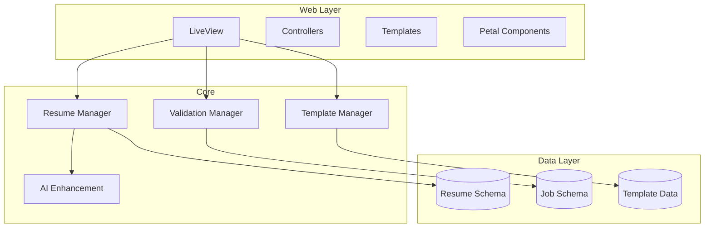

</details>

## Project Structure

```
finessume/
├── assets/
│   ├── css/
│   └── js/
├── config/
├── lib/
│   ├── finessume/
│   │   ├── resumes/          # Resume context
│   │   ├── templates/        # Template context
│   │   ├── accounts/         # User accounts
│   │   └── ai/              # AI integration
│   ├── finessume_web/
│   │   ├── live/            # LiveView modules
│   │   ├── components/      # Custom components
│   │   └── templates/       # HTML templates
│   └── finessume.ex
├── priv/
│   ├── repo/
│   └── static/
└── test/
```

## Setup

```bash
# Clone the repository
git clone <repository-url>
cd finessume

# Install dependencies
mix deps.get
mix ecto.setup

# Install Node.js dependencies
cd assets && npm install

# Start Phoenix server
mix phx.server
```

Visit [`localhost:4000`](http://localhost:4000) from your browser.

## Key Features

### LiveView Components

- Resume Editor
- Real-time Preview
- Template Selector
- PDF Generator
- AI Enhancement Interface

### Petal Components Integration

```elixir
# Example LiveView with Petal Components
defmodule FinessumeWeb.ResumeLive.Editor do
  use FinessumeWeb, :live_view
  use PetalComponents

  def render(assigns) do
    ~H"""
    <.container>
      <.h1>Resume Editor</.h1>

      <.card>
        <.form
          :let={f}
          for={@changeset}
          phx-change="validate"
          phx-submit="save">

          <.form_field type="text" form={f} field={:title} label="Title"/>
          <.button>Save</.button>
        </.form>
      </.card>
    </.container>
    """
  end
end
```

### User Journey

1. **Onboarding:** Users visit the landing page to learn about Finessume before registering or logging in.
2. **Registration & Login:** New users sign up or existing users log in to access the resume builder.
3. **Resume Creation:** Users start creating their resume using the intuitive LiveView editor.
4. **Real-time Editing:** Changes update in real-time, with options to select templates and modify content.
5. **AI Enhancement:** Users can enhance their resumes using integrated AI features.
6. **Finalization & Download:** Completed resumes can be saved, downloaded as PDFs, and shared.

## Schema Examples

```elixir
defmodule Finessume.Resumes.Resume do
  use Ecto.Schema
  import Ecto.Changeset

  schema "resumes" do
    field :title, :string
    field :content, :map
    field :template_version_id, :id
    field :user_id, :id

    timestamps()
  end

  def changeset(resume, attrs) do
    resume
    |> cast(attrs, [:title, :content])
    |> validate_required([:title, :content])
  end
end
```

## Development Commands

```bash
# Start development server
mix phx.server

# Run tests
mix test

# Generate migration
mix ecto.gen.migration create_resumes

# Run migrations
mix ecto.migrate

# Start IEx with Phoenix
iex -S mix phx.server
```

## Testing

```bash
# Run all tests
mix test

# Run specific test file
mix test test/finessume/resumes_test.exs

# Run tests with coverage
mix test --cover
```

## Environment Variables

Create a `.env` file with:

```
export OPENAI_API_KEY=your_api_key_here
export SECRET_KEY_BASE=your_secret_key
export DATABASE_URL=your_database_url
```

## Deployment

The application can be deployed to any platform that supports Elixir/Phoenix applications:

```bash
# Build release
MIX_ENV=prod mix release

# Run migrations in production
_build/prod/rel/finessume/bin/finessume eval "Finessume.Release.migrate"

# Start the application
_build/prod/rel/finessume/bin/finessume start
```

## Contributing

1. Fork the repository
2. Create your feature branch (`git checkout -b feature/amazing-feature`)
3. Run tests (`mix test`)
4. Commit your changes (`git commit -m 'Add amazing feature'`)
5. Push to the branch (`git push origin feature/amazing-feature`)
6. Open a Pull Request

## License

MIT License - see LICENSE file for details

# Resume Optimizer SaaS Architecture Design

## System Overview

This SaaS application will analyze resumes against job descriptions, provide a compatibility score (1-10), and automatically optimize ("finesse") resumes when the score is 7 or higher. The system leverages the Petal Boilerplate (Phoenix, Elixir, TailwindCSS, Alpine.js, LiveView) with LLM integration for intelligent document analysis.

## Domain Model

<details>
<summary>Click to expand Domain Model Diagram</summary>

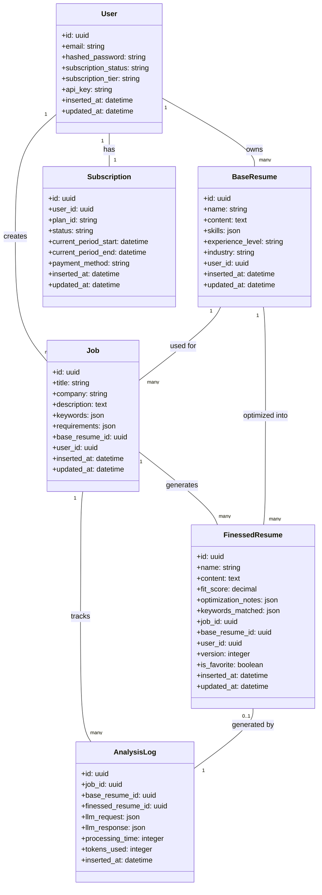

</details>

## Context Architecture

<details>
<summary>Click to expand Context Architecture Diagram</summary>

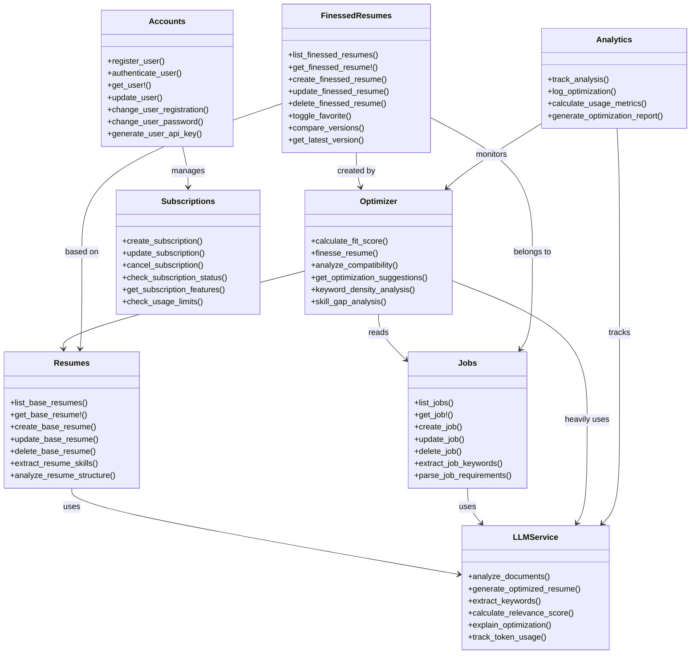

</details>

## Application Flow

### Resume Optimization Process

<details>
<summary>Click to expand Resume Optimization Process Diagram</summary>

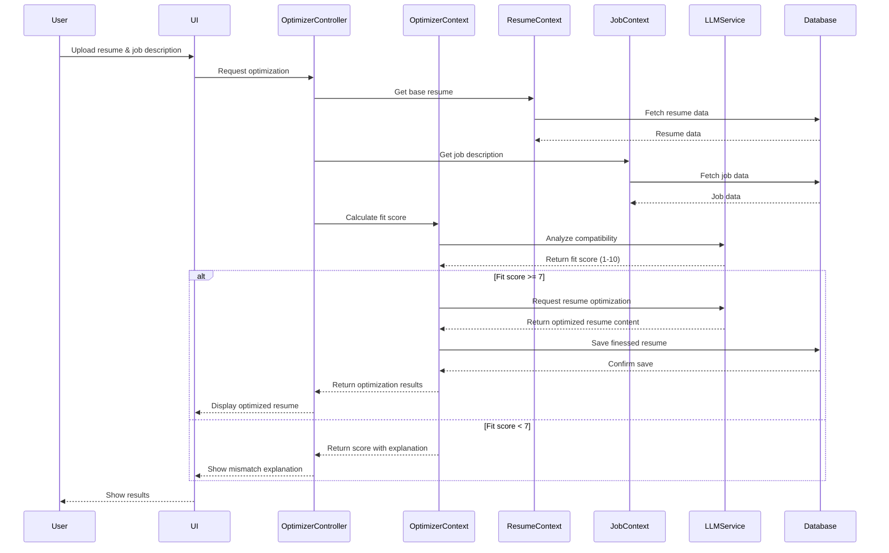

</details>

### User Authentication Flow

<details>
<summary>Click to expand User Authentication Flow Diagram</summary>

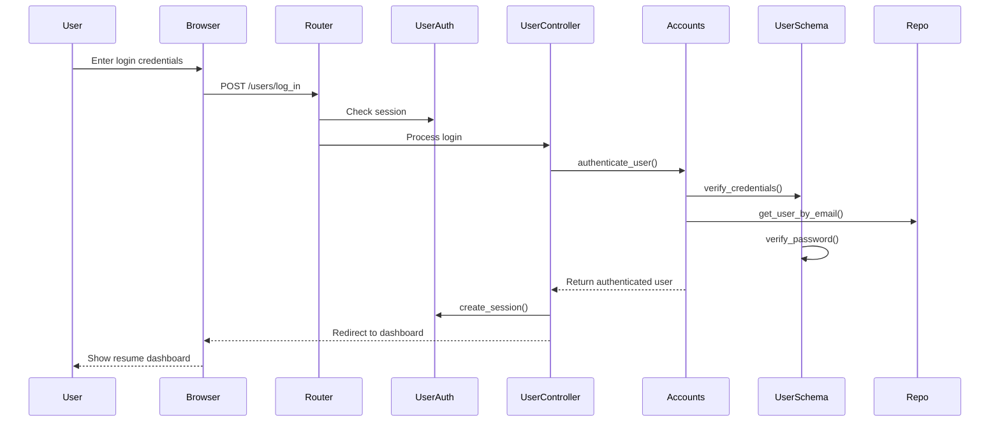

</details>

## LiveView Structure

<details>
<summary>Click to expand LiveView Structure Diagram</summary>

```mermaid
classDiagram
    class DashboardLive {
        +mount()
        +handle_params()
        +render()
        +handle_event("filter_resumes")
        +handle_event("filter_jobs")
    }

    class ResumeManagementLive {
        +mount()
        +handle_params()
        +render()
        +handle_event("upload_resume")
        +handle_event("edit_resume")
        +handle_event("delete_resume")
    }

    class JobManagementLive {
        +mount()
        +handle_params()
        +render()
        +handle_event("add_job")
        +handle_event("edit_job")
        +handle_event("delete_job")
    }

    class OptimizerLive {
        +mount()
        +handle_params()
        +render()
        +handle_event("start_analysis")
        +handle_event("view_optimization")
        +handle_event("save_finessed_resume")
    }

    class FinessedResumeLive {
        +mount()
        +handle_params()
        +render()
        +handle_event("toggle_favorite")
        +handle_event("compare_versions")
        +handle_event("export_resume")
    }

    class AnalyticsLive {
        +mount()
        +handle_params()
        +render()
        +handle_event("filter_data")
        +handle_event("export_report")
    }

    class SubscriptionLive {
        +mount()
        +handle_params()
        +render()
        +handle_event("change_plan")
        +handle_event("update_payment")
        +handle_event("cancel_subscription")
    }

    class NavbarComponent {
        +render()
    }

    class ResumeFormComponent {
        +update()
        +handle_event("validate")
        +handle_event("save")
    }

    class JobFormComponent {
        +update()
        +handle_event("validate")
        +handle_event("save")
    }

    class ScoreDisplayComponent {
        +update()
        +render()
    }

    class OptimizationResultComponent {
        +update()
        +render()
        +handle_event("accept_changes")
        +handle_event("reject_changes")
    }

    DashboardLive --> NavbarComponent : uses
    ResumeManagementLive --> ResumeFormComponent : uses
    JobManagementLive --> JobFormComponent : uses
    OptimizerLive --> ScoreDisplayComponent : uses
    OptimizerLive --> OptimizationResultComponent : uses
    FinessedResumeLive --> OptimizationResultComponent : uses
```

</details>

## UI Wireframes

#### Dashboard View

<details>
<summary>Click to expand Dashboard View Wireframe</summary>

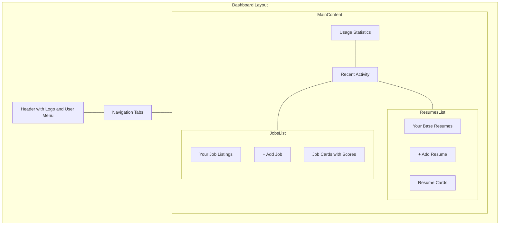

</details>

### Optimization Process View

<details>
<summary>Click to expand Optimization Process Wireframe</summary>

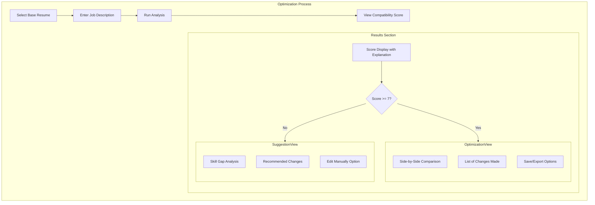

</details>

## Site Map

<details>
<summary>Click to expand Site Map Diagram</summary>

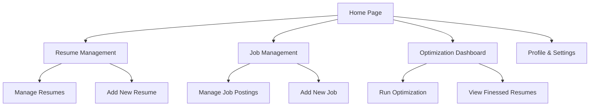

</details>

## Updated User Journey

<details>
<summary>Click to expand Updated User Journey Diagram</summary>

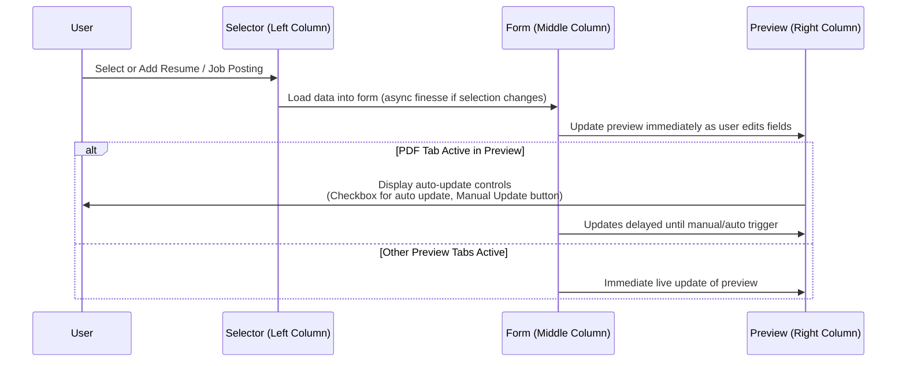

</details>

## Extended Site Map – Future Features

<details>
<summary>Click to expand Extended Site Map Diagram (Proposed)</summary>

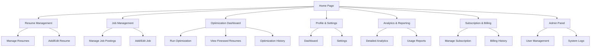

</details>

## Extended User Journey – Future Enhancements

<details>
<summary>Click to expand Extended User Journey Diagram (Proposed)</summary>

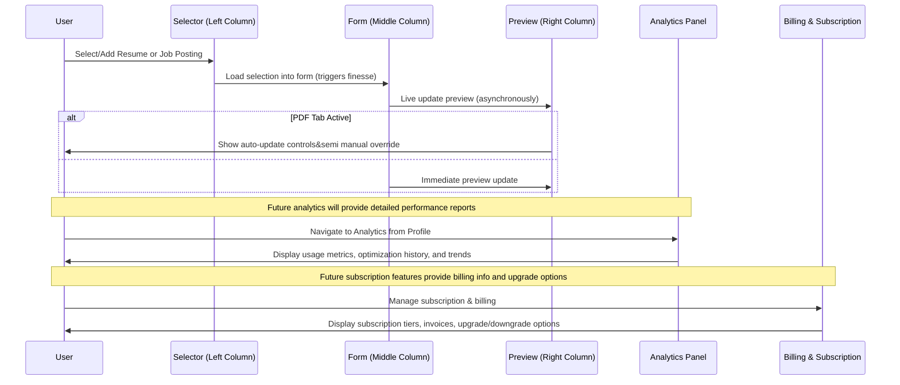

</details>

## OpenAI Integration Flow

<details>
<summary>Click to expand OpenAI Integration Flow Diagram</summary>

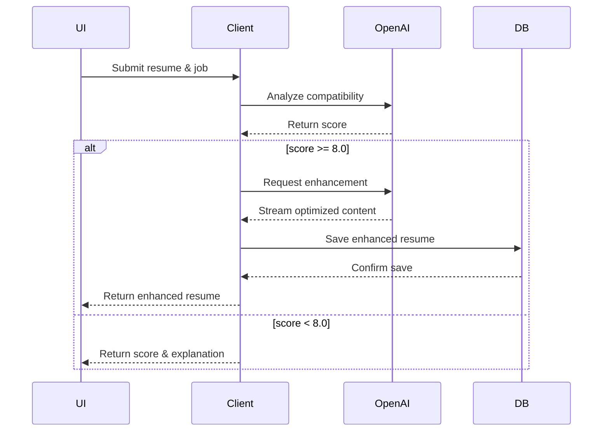

</details>

## OpenAI Client Usage

<details>
<h2><summary> Example Client Usage (Elixir)</summary></h2>
<details>
    <summary>Elixir code for processing a job, enhancing a resume, and processing multiple jobs in parallel.</summary>

```elixir
# Process a job description


{:ok, result} = Client.process_job(description)

# Enhance a resume
{:ok, enhanced} = Client.enhance_resume(resume, job)

# Process multiple jobs in parallel
results = Client.process_jobs(descriptions)
```
</details>

---

<details>
    <summary>Elixir code demonstrating regular and streaming completions using OpenAIClient.chat_completion.</summary>

```elixir
# Regular completion
{:ok, response} = OpenAIClient.chat_completion(request)

# Streaming completion
OpenAIClient.chat_completion(request, fn chunk ->
        # Handle each chunk
end)
```
</details>

---

<details>
    <summary>Elixir function definition for enhancing a resume based on a job with conditional matching and error handling.</summary>

```elixir
def enhance_resume(resume, job, opts \\ []) do
        with score when score >= 8.0 <- calculate_match_score(resume, job),
                         {:ok, enhanced} <- request_enhancement(resume, job, opts),
                         {:ok, stored} <- save_enhanced_resume(enhanced) do
                {:ok, %{stored: stored, enhanced: enhanced}}
        else
                score when is_number(score) ->
                        {:error, {:low_fit_score, score}}

                {:error, reason} ->
                        {:error, :enhancement_failed}
        end
end
```
</details>

---

<details>
    <summary>Elixir code for chat_completion function using Req HTTP client and Agent for handling streaming responses.</summary>

```elixir
def chat_completion(request, callback) do
        {:ok, agent} = Agent.start_link(fn -> [] end)

        response =
                Req.post(
                        @chat_completions_url,
                        json: set_stream(request, true),
                        auth: {:bearer, api_key()},
                        into: fn
                                {:data, data}, acc ->
                                        buffer = Agent.get(agent, & &1)
                                        {buffer, events} = parse(buffer, data)
                                        Enum.each(events, callback)
                                        :ok = Agent.update(agent, fn _ -> buffer end)
                                        {:cont, acc}
                        end
                )

        :ok = Agent.stop(agent)
        response
end
```
</details>

---

<details>
    <summary>JSON payload structure representing a resume with personal info, experience, and skills.</summary>

```json
{
        "resume": {
                "personalInfo": { "name": "string", "contact": "object" },
                "experience": { "items": ["array"] },
                "skills": { "items": ["array"] }
        }
}
```
</details>

---

<details>
    <summary>Elixir code showing error handling when enhancing a resume via pattern matching on result tuples.</summary>

```elixir
case enhance_resume(resume, job) do
        {:ok, enhanced} ->
                # Success path
                {:ok, enhanced}

        {:error, {:low_fit_score, score}} ->
                # Score too low
                {:error, "Score #{score} below threshold"}

        {:error, :enhancement_failed} ->
                # Technical error
                {:error, "Enhancement failed"}
end
```
</details>

---

<details>
    <summary>Elixir tests validating successful resume enhancement and error handling for low-fit scores.</summary>

```elixir
test "enhances resume when score is sufficient" do
        resume = build(:resume)
        job = build(:job)

        assert {:ok, enhanced} = Client.enhance_resume(resume, job)
        assert enhanced.score >= 8.0
end

test "returns error when score is insufficient" do
        resume = build(:resume)
        job = build(:job, requirements: ["20 years experience"])

        assert {:error, {:low_fit_score, score}} = Client.enhance_resume(resume, job)
        assert score < 8.0
end
```
</details>

## Future Enhancements

Planned improvements to the enhancement flow:

1.  Parallel processing for batch enhancements
2.  Improved scoring algorithms
3.  Caching of common enhancements
4.  A/B testing of enhancement strategies
5.  User feedback integration
